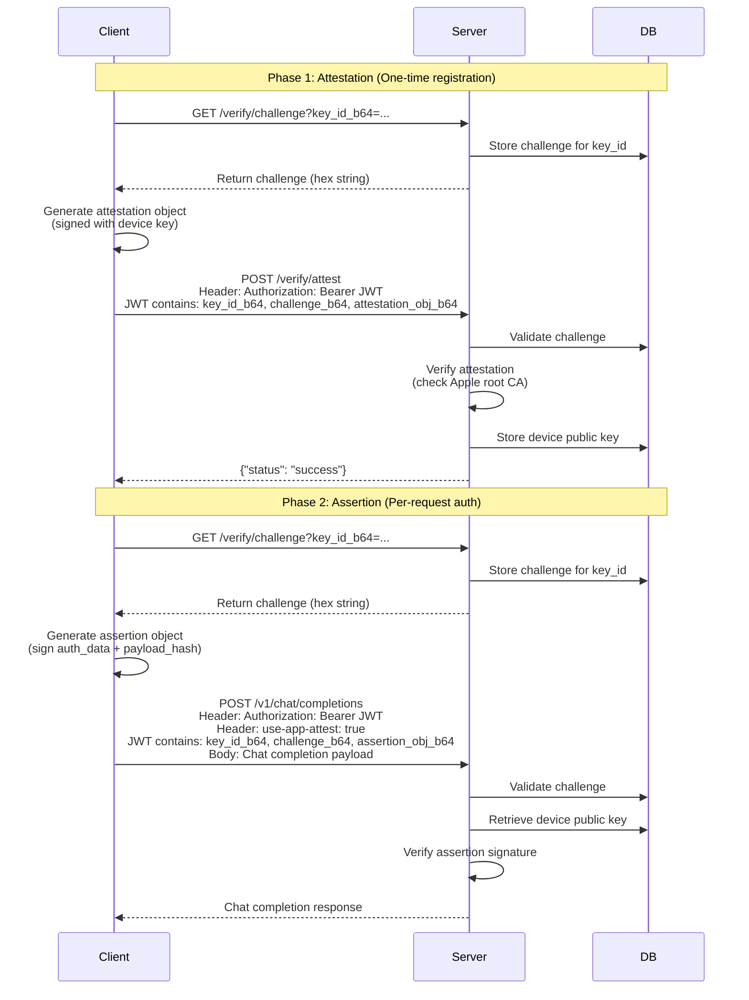

# App Attest QA Testing Guide

This doc explains how to test the App Attest authentication flow using the QA scripts. App Attest is Apple's security framework that verifies the authenticity of devices connecting to the server.

## Overview

The App Attest flow consists of two main phases:

1. **Attestation** (one-time device registration): The device proves its authenticity using Apple's root certificate
2. **Assertion** (per-request authentication): The device signs each request to prove it's the same registered device

## Prerequisites

- MLPA server running with `APP_ATTEST_QA=true` environment variable
- PostgreSQL database with App Attest tables migrated
- Dependencies installed (including `typer` from the `qa` dependency group)

## Certificate Generation

Before testing, generate QA certificates and device key material:

```bash
python scripts/generate_qa_app_attest_certificate.py
```

This script:

1. Generates a test root CA certificate and private key using `pyattest` testutils
2. Creates a device EC key pair (SECP256R1)
3. Derives `key_id` from the device public key: `SHA256(uncompressed_public_key)`
4. Stores everything in `/tmp/qa_certificates/`:
   - `root_cert.pem` - Root CA certificate
   - `root_key.pem` - Root CA private key
   - `key_id.json` - Device key pair and key_id in various formats

The `key_id.json` file contains:

- `key_id_b64`: Base64-encoded key ID (used in API calls)
- `device_private_key_pem`: Device private key for generating attestation/assertion objects
- `device_public_key_uncompressed_b64`: Device public key in uncompressed format

**Reference**: [`scripts/generate_qa_app_attest_certificate.py`](../scripts/generate_qa_app_attest_certificate.py)

## App Attest Flow

The complete authentication flow consists of four steps:



### Key Concepts

**Challenge**: A one-time random value issued by the server. Used to prevent replay attacks. Challenges are:

- Stored in the database with expiration time
- Validated before attestation/assertion verification
- Deleted after one use

**Attestation Object**: CBOR-encoded object containing:

- Device public key (in COSE format)
- Certificate chain signed by Apple's root CA (or QA root CA in testing)
- Authenticator data including key_id
- Signature over `auth_data + SHA256(challenge)`

**Assertion Object**: CBOR-encoded object containing:

- Authenticator data (app_id hash, flags, counter, key_id)
- Signature over `SHA256(auth_data + payload_hash)`

**Key ID**: SHA256 hash of the device's uncompressed EC public key. Used to:

- Store and retrieve device public keys
- Associate challenges with devices
- Identify devices in the system

**Reference**:

- Challenge generation: [`src/mlpa/core/routers/appattest/appattest.py:59`](../src/mlpa/core/routers/appattest/appattest.py#L59)
- Attestation verification: [`src/mlpa/core/routers/appattest/appattest.py:94`](../src/mlpa/core/routers/appattest/appattest.py#L94)
- Assertion verification: [`src/mlpa/core/routers/appattest/appattest.py:153`](../src/mlpa/core/routers/appattest/appattest.py#L153)

## CLI Usage

The QA script provides two commands via Typer CLI:

### Register Device (Attestation)

Performs one-time device registration (steps 1-2):

```bash
python scripts/appattest_qa.py register
```

Options:

- `--key-id-file PATH`: Path to `key_id.json` (default: `/tmp/qa_certificates/key_id.json`)
- `--mlpa-url URL`: Override MLPA base URL (default: from env or `http://0.0.0.0:8080`)

**What it does**:

1. Loads device key material from `key_id.json`
2. Requests attestation challenge from `/verify/challenge`
3. Generates attestation object signed with device private key
4. Submits attestation to `/verify/attest` with JWT in Authorization header
5. Server verifies attestation and stores device public key

**Reference**: [`scripts/appattest_qa.py:335`](../scripts/appattest_qa.py#L335)

### Request Completion (Assertion)

Requests a chat completion with assertion authentication (steps 3-4):

```bash
python scripts/appattest_qa.py completion
```

Options:

- `--key-id-file PATH`: Path to `key_id.json` (default: `/tmp/qa_certificates/key_id.json`)
- `--mlpa-url URL`: Override MLPA base URL (default: from env or `http://0.0.0.0:8080`)

**What it does**:

1. Loads device key material from `key_id.json`
2. Requests assertion challenge from `/verify/challenge`
3. Generates assertion object signed over `auth_data + payload_hash`
4. Submits chat completion request to `/v1/chat/completions` with:
   - JWT in Authorization header containing assertion data
   - `use-app-attest: true` header
   - Chat completion payload in request body

**Reference**: [`scripts/appattest_qa.py:367`](../scripts/appattest_qa.py#L367)

## Security Notes

- QA certificates are for testing only. Never use in production.
- The JWT signature is not verified in QA mode. In production, proper JWT verification should be implemented.
- Challenges are single-use and time-limited to prevent replay attacks.
- The assertion signature binds requests to specific payloads, preventing request tampering.
